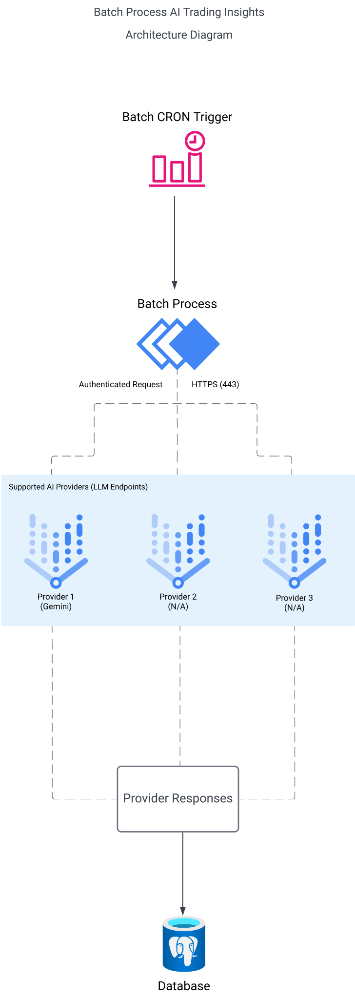

# AI Trading Insights Batch Process Design

The batch process is designed to execute daily with flexibility for more frequent execution. It ensures efficient interaction between the database, APIs, and the integrated Large Language Models (LLMs) to provide valuable trading insights.

---

## Workflow Steps

### 1. Trigger Cron Job

- A scheduled job leverages a **Node.js cron library** (e.g., `node-cron`, `cron`, or similar) to define and execute the batch process.
- The job is configured with a `cronTime` to run every 24 hours by default, but it is designed to support manual or more frequent triggers when needed.
- The cron job ensures consistent and reliable execution of the batch process by maintaining a flexible scheduling mechanism.

### 2. Fetch Trading Data

- The batch process initiates by invoking the **TradingDataService**, which is responsible for retrieving the initial trading data.
- The `TradingDataService` serves as the interface to collect and aggregate trading data.
- The structure and format of the fetched data follow the specifications outlined in the **`model-input-data.md` document**, ensuring standardization and compatibility with subsequent steps in the batch process.

### 3. Pre-process Data

- Validation checks are performed on the retrieved data to ensure it is valid, complete, and in the correct structure before sending it to the LLM. This step is critical for reducing costs and preventing unnecessary API calls to the LLM.
- The **instruction field** will specify the details of the response expected from the LLM. This includes a **fixed schema** that defines the format of the expected response, the specifics of the schema has not been decided yet and implementation progress will contribute towards it's design to ensure improved accuracy but it is expected to contain key fields such as indicators to analyse, response data types and structure. This ensures:
  - The results can be acted upon easily in downstream processes.
  - The results can be stored seamlessly in the database without additional transformation or processing.

### 4. Send Data to LLM

- The pre-processed and validated data is sent to a cloud endpoint via the **service layer**, which facilitates communication with integrated LLM providers.
- The LLM analyzes the data to generate trading insights, such as **support levels**, **resistance levels**, **trends**, **indicator analysis**, and other relevant outputs, which are formatted according to the **specified schema**.
- This specified schema ensures the results are consistent, structured, and actionable for storage and downstream processes.

### 5. Store Analysis Results

- The insights generated by the LLM are received and stored in the database, TypeORM repositories are leveraged to perform database operations. Key actions include:
  - Writing results to the `ai_analysis` table, associating each record with the relevant token or entity.
  - Capturing metadata such as the **full output response**, **analysis extract**, **timestamp of the analysis**, and the **LLM provider used**.

### 6. Expose Insights via API

- The stored insights are exposed to the application UI through **Express.js APIs**. These APIs:
  - Provide endpoints to retrieve all insights.
  - TypeORM repositories are leveraged to perform database operations.

#### Caching Implementation

- A caching mechanism will be implemented to reduce database load and improve response times.
- The cache duration will be set to match the cron job frequency, ensuring that the insights remain up to date and aligned with the batch process execution.
- The API layer will first check the cache for requested insights before querying the database. If data is available in the cache, it will be served directly; otherwise, it will be fetched from the database and stored in the cache for subsequent requests.

---

## Key Design Considerations

### 1. Scalability

- The batch process is designed to handle increasing data volume by:
  - Decoupling LLM provider integrations into modular provider classes.
  - Allowing horizontal scaling of batch processing and API services.

### 2. Data Validation

- Validation checks are performed during the pre-processing stage to ensure data is valid before being sent to the LLM.
- This reduces unnecessary costs by avoiding invalid API calls and ensures higher reliability in results.

### 3. Fixed Response Schema

- The instruction to the LLM will define a fixed schema for the expected response. This schema includes:
  - Key fields, data types, and structure to ensure consistency.
  - A format that allows for easy storage in the database and seamless integration with downstream processes.
- This approach simplifies acting upon the results and ensures a predictable format for processing whilst also supporting further provider integrations.

### 4. Flexibility

- The batch process supports multiple LLM providers via a modular integration pattern:
  - Each LLM is implemented as a **provider module**, which includes configuration files and API methods tailored to that specific LLM.
  - New LLMs can be added with minimal changes to the core process whilst following the same structure and processing.

### 5. Security

- Sensitive data, such as API keys and tokens, is securely managed using environment variables.

---

## Technical Stack

- **Database**: PostgreSQL for storing trading data and analysis results.
- **Database ORM**: TypeORM for managing database interactions in the repository layer and ensuring a scalable, maintainable structure.
- **API Layer**: Express.js for exposing insights and facilitating interaction between the UI and backend services.
- **Batch Processing**: Node.js for executing the batch process with a recommended cron library (e.g., `node-cron`, `cron`, or similar).
- **LLM Service Layer**: A dedicated service which handles all communication with LLM providers through modular provider integrations (This will be architectured in a way that allows additional to be added easily).
- **LLM Integration**: Each LLM is implemented as a provider integration, with clear separation of concerns for maintainability.

---

This document provides a comprehensive overview of the batch process design, with technical considerations to ensure efficiency, reliability, and scalability.

## Batch Process Architecture Design

