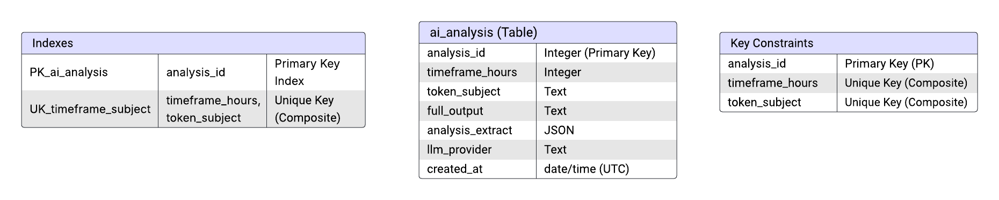

# AI Trading Insights Database Design

The database is designed to store and manage AI analysis results efficiently. It ensures compatibility with the batch process, API services, and downstream applications, while maintaining scalability and reliability.

---

## Database Structure

### 1. **Tables**

#### **`ai_analysis`**

- Stores analysis results generated by the LLM.
- **Columns:**
  - `analysis_id` (Primary Key): `SERIAL` (Auto-incrementing unique identifier for the analysis).
  - `timeframe_hours`: `INTEGER` (The timeframe of the analysis in hours, numeric, e.g., 4).
  - `token_subject`: `TEXT` (The subject or context of the analysis).
  - `full_output`: `TEXT` (Full output response from the LLM).
  - `analysis_extract`: `JSONB` (A summarized or key extract from the analysis).
  - `llm_provider`: `TEXT` (The LLM provider used for the analysis).
  - `created_at`: `TIMESTAMP WITH TIME ZONE` (Timestamp when the record was created, stored in UTC).

---

## Key Design Considerations

### 1. **Scalability**

- **Indexes:**
  - Indexes on `ai_analysis.token_subject` and `ai_analysis.llm_provider` for faster lookups and queries.

### 2. **Data Integrity**

- **Constraints:**
  - Ensure `token_subject` is non-nullable.
  - Ensure `full_output` and `analysis_extract` capture meaningful data and are not empty.

### 4. **Flexibility**

- Allow easy extension of the schema to support additional fields or metadata for new analysis types or LLM providers.

---

## Technical Stack

- **Database Management System:** PostgreSQL
- **Key Features Used:**
  - Creation of indexes for query optimization to enhance the performance of data retrieval operations.

---

This database design ensures seamless integration with the batch process, API layer, and downstream applications, while maintaining scalability, performance, and data integrity.

## ERD Database Design Diagram

