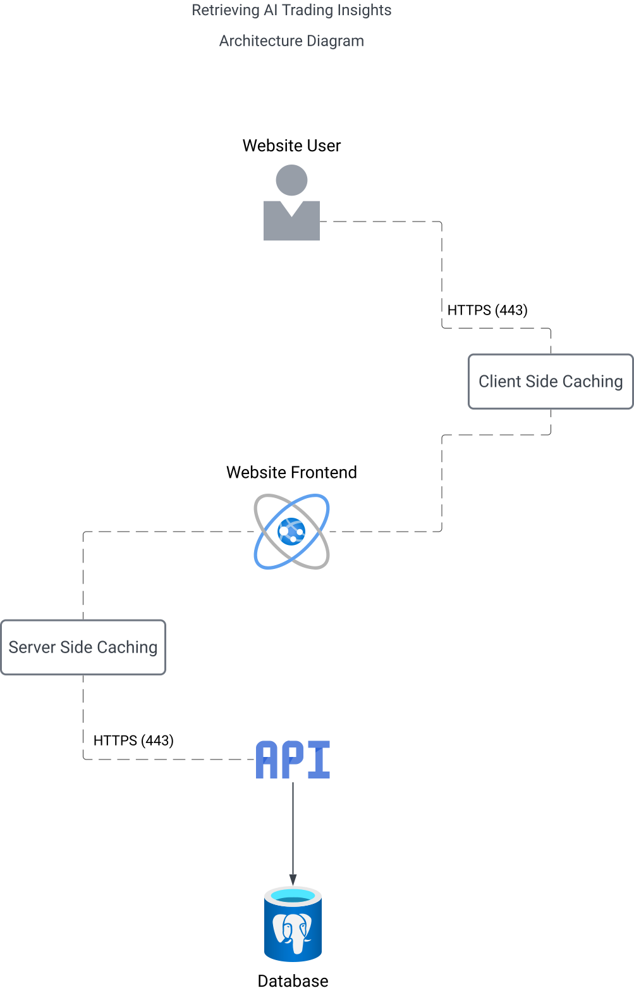

# AI Trading Insights Project Design

## 1. Overview

This proof-of-concept (POC) aims to develop a system that simplifies the interpretation of trading statistics, historical data, and token movements for retail traders. By leveraging AI-powered insights, the system will analyze key trading indicators (e.g., support levels, resistance levels, and market trends) and present actionable information via a user-friendly application interface.

The architecture is designed to support **scalability, performance optimization, and extensibility**, allowing seamless integration with additional data providers. The system utilizes **a daily batch process, cloud-based LLM (Large Language Model) analysis, and caching mechanisms** (both client-side and server-side) to enhance efficiency.

---

## 2. Referenced Sections

Below are the supporting documents that provide detailed insights into various aspects of the AI Trading Insights system.

### 1. [Token Criteria](./token-criteria.md)

Defines the selection parameters for tokens analyzed in the AI Trading Insights process.

### 2. [Model Input Data](./model-input-data.md)

Specifies the data sources, formats, and preprocessing steps required for valid processing.

### 3. [Batch Process Design](./batch-process-design.md)

Describes the scheduled cron job, data ingestion workflow, and processing.

### 4. [Database Design](./database-design.md)

Details the database schema, table structure, indexing strategies, and optimization.

### 5. [Model Research](./model-research.md)

Documents research on LLM methodologies, benchmarks and selection criteria.

---

## 3. System Architecture & Technical Design

The AI Trading Insights system consists of several interconnected components:

- **Data Ingestion**: A scheduled cron job, running in an Express.js backend, triggers the daily processing pipeline.
- **Provider Integration**: The system retrieves the latest market data from trading data providers (referenced in `model-research`).
- **LLM Analysis**: A cloud-hosted LLM processes the formatted data, extracting meaningful trading insights.
- **Database Storage**: The AI-generated insights are stored in a **PostgreSQL database**, ensuring efficient data retrieval and integrity.
- **API & UI Layer**: The frontend retrieves stored insights via an API and employs **client-side caching (TanStack Query)** to minimize redundant API calls, improving the user experience.

---

# AI Trading Insights - Architecture Overview

## 4. System Components

### 1. **Website User**

- End users access the AI-powered trading insights via a **web application**.
- Communication between the user and the system is secured via **HTTPS (port 443)**.

### 2. **Client-Side Caching**

- Frequently accessed data is **cached on the client-side** to enhance responsiveness.
- This reduces the number of API requests and optimizes user experience.

### 3. **Website Frontend**

- The **frontend is built using modern JavaScript frameworks (e.g., React)**.
- It is responsible for rendering insights, handling user interactions, and communicating with the backend API.

### 4. **Server-Side Caching**

- A caching layer is implemented at the **server level** to store frequently requested insights.
- This reduces the database load and improves system efficiency.

### 5. **API Layer**

- The **API serves as the bridge** between the frontend and backend, handling requests and responses securely.
- It manages **data retrieval, processing, and caching** for optimal performance.

### 6. **Database**

- The system stores AI-generated trading insights in a **PostgreSQL database**.
- The database supports **complex analytical queries** and ensures **data integrity**.

---

## 5. Data Flow

1. The **Website User** requests trading insights via the frontend.
2. **Client-Side Caching** checks if the requested data is available. If not, the request is forwarded to the API.
3. The **Website Frontend** sends an **HTTPS request** to the **API Layer**.
4. The API first checks the **Server-Side Cache**; if data is cached, it is retrieved and returned.
5. If the requested data is not in cache, the **API queries the PostgreSQL database**.
6. The database processes the request and returns the required insights.
7. The **Server-Side Cache** is updated with the new data to enhance future requests.
8. The API sends the insights back to the frontend, where they are cached **client-side** for a seamless user experience.

---

## 6. Interaction Architecture Design

Below is a high-level **interaction architecture diagram** illustrating the flow of data between system components.

---

## **Disclaimer on Testing and Project Evolution**

This document presents the current state of testing, research, and market analysis for automated Cardano token analysis. As the project advances and our understanding of both the Cardano ecosystem and the broader AI landscape evolves, certain implementations or methodologies may shift to accommodate new insights and best practices. Our goal is to **adapt to the fast-moving AI industry** to ensure we deliver **maximum value** and maintain a **cutting-edge, future-proof solution**.
